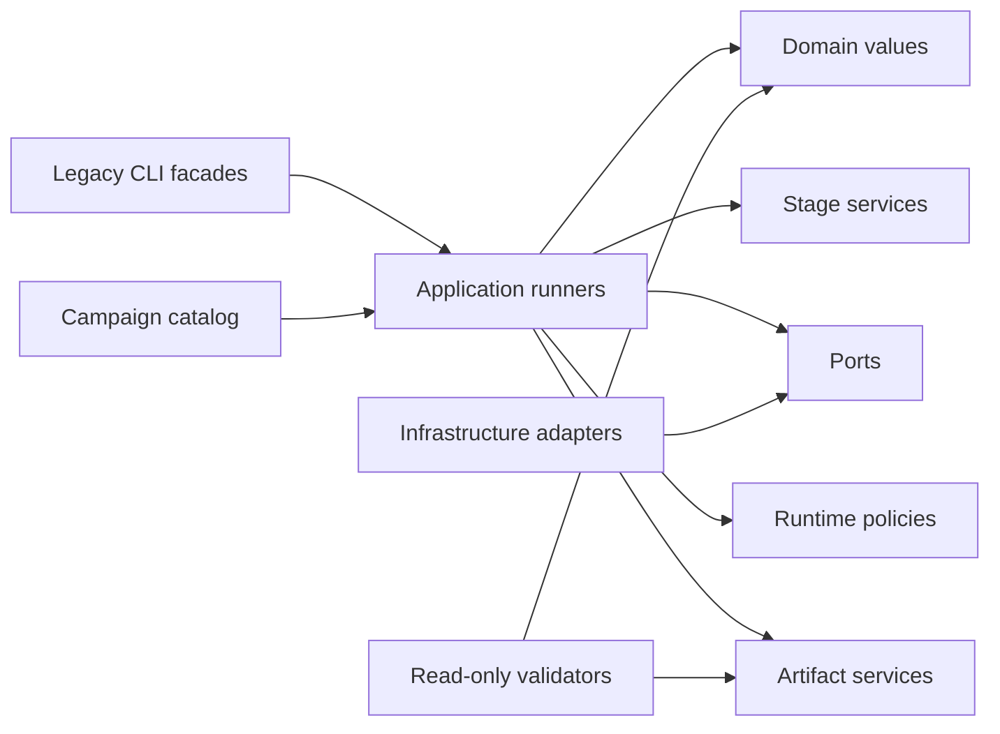

# Generation-code architecture

This document describes the code that prepares and runs experiments. Metric
implementations under `evaluation/` are intentionally outside this design.

## Design goals

- Keep scientific factors explicit and immutable.
- Keep provider SDKs and filesystem writes behind injected boundaries.
- Give each runner one orchestration responsibility.
- Preserve historical commands and artifact schemas through thin facades.
- Make every protocol decision testable without calling a model.

The redesign uses composition and dependency injection. It does not force pure
parsers or small deterministic transformations into classes when a function is
clearer.

## Package map

```text
few_shot_experiments/
├── run_all_variants.sh             thin shell compatibility entrypoint
├── run_script.py                   standard-stage compatibility facade
├── run_full_pipeline.py            dialogue compatibility facade
├── run_coherence_structured.py     planned-pipeline compatibility facade
├── validate_controlled_derived_run.py
└── attribute_first/
    ├── domain/                     immutable experiment vocabulary
    ├── compatibility/              old aliases resolved at one boundary
    ├── campaign/                   16-cell catalog and campaign orchestration
    ├── application/                use-case runners
    ├── stages/                     stage-specific generation behavior
    ├── runtime/                    attempts, usage, environment, conversation
    ├── ports/                      provider and persistence protocols
    ├── infrastructure/             concrete SDK/filesystem adapters
    ├── prompting/                  deterministic prompt construction helpers
    ├── artifacts/                  result/provenance persistence
    └── validation/                 composable, read-only completion gates
```

## Dependency direction



`domain/` has no provider, dataframe, filesystem, or application dependency.
Application runners receive collaborators explicitly, so offline fakes can
replace model and storage boundaries in tests.

## Main objects

### Experiment definition

- `ExperimentCatalog` is the single source of the controlled 16-cell matrix.
- `CatalogCell` and `PipelineFactors` make every controlled treatment explicit.
  `ExperimentCell` and `StageSpec` remain stricter domain composition types
  exercised by offline contracts; the live standard-stage registry uses
  `StageBinding` because it must also carry parser, converter, schema, and
  prompt-construction behavior.
- `LegacyNameResolver` translates historical names such as `g3flash`,
  `fullcot`, `coherence`, or `mega` at the compatibility boundary. Runtime
  provenance consumes the resulting factors rather than branching on aliases.
- `ModelProvider.from_model_id` routes full Google/OpenAI IDs and rejects
  unknown providers before a request is attempted.
- `CampaignPlan` preserves the declared execution order without shell arrays.
- `CampaignScheduler` produces deterministic dependency-safe batches, gives
  zero-shot standards priority, assigns the existing internal pipeline worker
  count, and blocks derived cells until their exact upstream completes.
  Independent standard cells use four internal workers and therefore occupy an
  exclusive campaign batch; dialogue and derived cells use one internal worker.
  Smoke execution keeps the scheduler's one-internal-worker default, so its two
  lightweight processes can still run together.

### Execution

- `CampaignRunner` selects catalog cells, prevents overwrite, and delegates.
- `StageRegistry` resolves each standard-stage alias to one typed binding
  containing its semantic `StageKind`, parser, converter, optional schema, and
  prompt-construction name. Alias-specific prompt names (for example
  `fusion_in_context_v2` -> `FiC_v2`) are selected at that boundary; the
  originally requested alias remains unchanged in arguments and provenance.
- `StageConfigContract` performs the provider-free preflight shared by
  execution and provenance. Before an output directory is claimed, it verifies
  that the pipeline label and the stage config resolve to the same `StageKind`
  and validates model ID, retry and token budgets, demonstrations,
  temperature, output limit, and structured-output types.
- `GenerationDefaults` owns the shared Gemini 3 Flash Preview, structured
  output, and role-transport defaults. Standard and dialogue application
  services ask it to resolve silent programmatic structured-output fields, so
  a missing attribute cannot reactivate free text behind the CLI contract.
- `StandardPipelineRunner` executes the resolved binding; the compatibility
  facade no longer dispatches stages with procedural conditionals.
- `DialoguePipelineRunner` is the stateful multi-turn facade. It composes
  dedicated services for session/cache binding, CS, AH, FiC, just-in-time
  demonstrations, exception propagation, and population-ordered persistence.
- The dialogue protocol validates that CS, optional AH, and FiC declare the
  exact same `model_name` before the application claims an output directory,
  writes provenance, or creates the single shared provider session.
- `SequentialDialoguePipelineRunner` delegates strict JSON/source contracts,
  transactional per-instance conversations, evaluator conversion, and
  append-only population persistence to separate modules.
- `PlannedPipelineRunner` owns clustering, ordering, and structured fusion.
- `AttemptExecutor` owns retry evidence and parse/generation failure phases.
  Exhausted provider or model-output parsing attempts become explicit terminal
  rows; unexpected converter, invariant, or programming exceptions propagate
  and fail the run instead of being mislabeled as model failures.
- `UsageLedger` owns aggregate usage and thread-local response evidence.
- `PipelineTokenUsageAggregator` discovers stage ledgers, validates their
  counters, and persists the whole-pipeline breakdown without bloating the
  artifact facade.
- `ProtocolEnvironment` validates feature flags and restores process state.

### Boundaries and artifacts

- `ModelGateway` is the provider-independent generation port.
- `ArtifactStore` is the persistence port.
- `JsonArtifactStore` performs atomic writes below one explicit root.
- Standard and dialogue persistence treat `token_usage.json` as mandatory run
  evidence; a failed write aborts the run instead of reporting false success.
- `OutputDirectoryClaim` atomically owns a fresh standard pipeline directory;
  nested stages may write only below that claimed root.
- Artifact/provenance objects preserve historical filenames and JSON schemas.
- Validators compose population, attempt, provenance, dialogue, terminal, and
  metric-presence checks without changing evaluation semantics.

## Compatibility policy

The old Python functions and CLI flags remain public. They capture their module
globals and inject them into the new objects. This detail is deliberate: older
notebooks and offline tests can still monkey-patch the same boundaries, while
new code depends on explicit collaborators.

Frozen historical configurations and release artifacts keep their original
names and hashes. New controlled configurations use semantic paths under
`configs/controlled/test/{MDS,LFQA}/`.

Controlled stage configs fail closed: every execution-critical field must be
explicit. Historical configs remain executable through documented effective
defaults when they omit fields that predate the controlled protocol, including
budgets, output length, structured output, or the iterative stage's subtask.

## Adding a generation variant

1. Express the treatment as `PipelineFactors`; do not create a new opaque name.
2. Add its stage specs and readable configs.
3. Add one typed `CatalogCell`.
4. Implement or reuse an application runner through the existing ports.
5. Add offline characterization and mutation tests.
6. Add a completion validator before any live generation is authorized.

Do not add orchestration to the shell launcher, dynamically import source files,
or encode the requested model in a pipeline filename.
